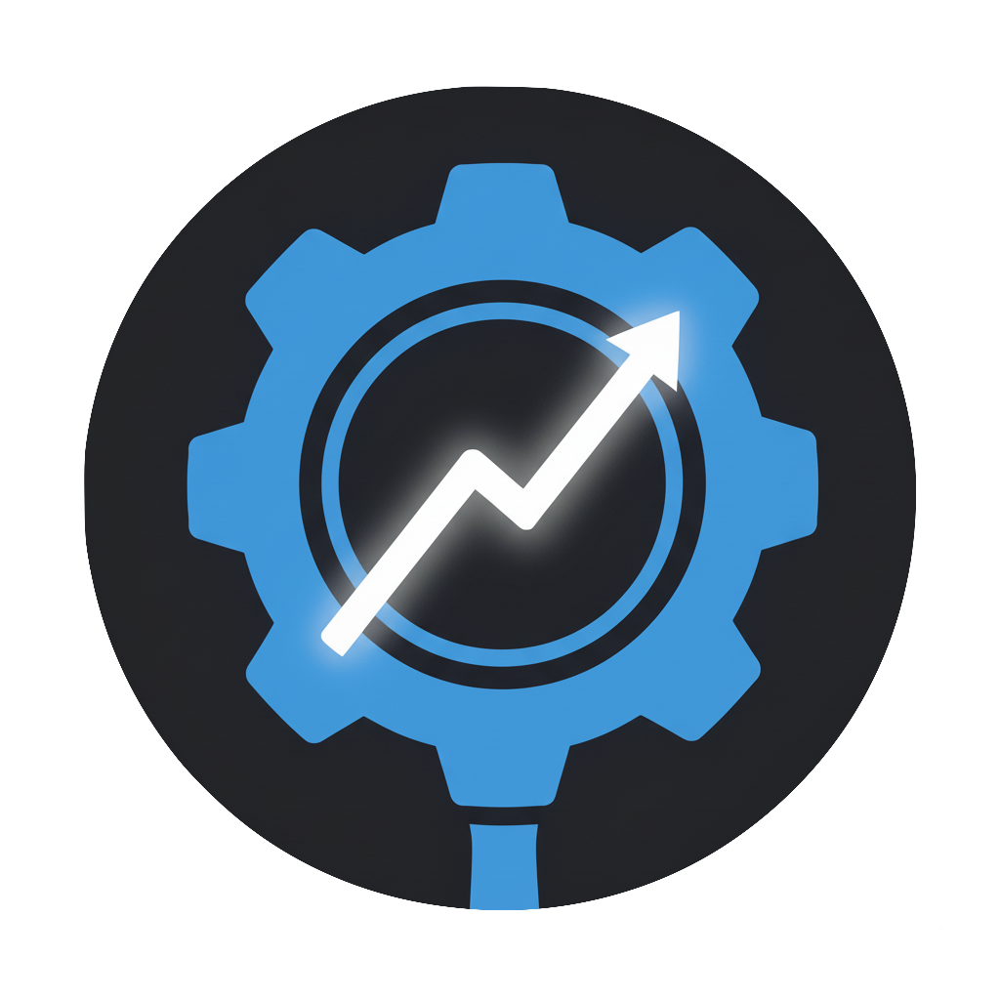
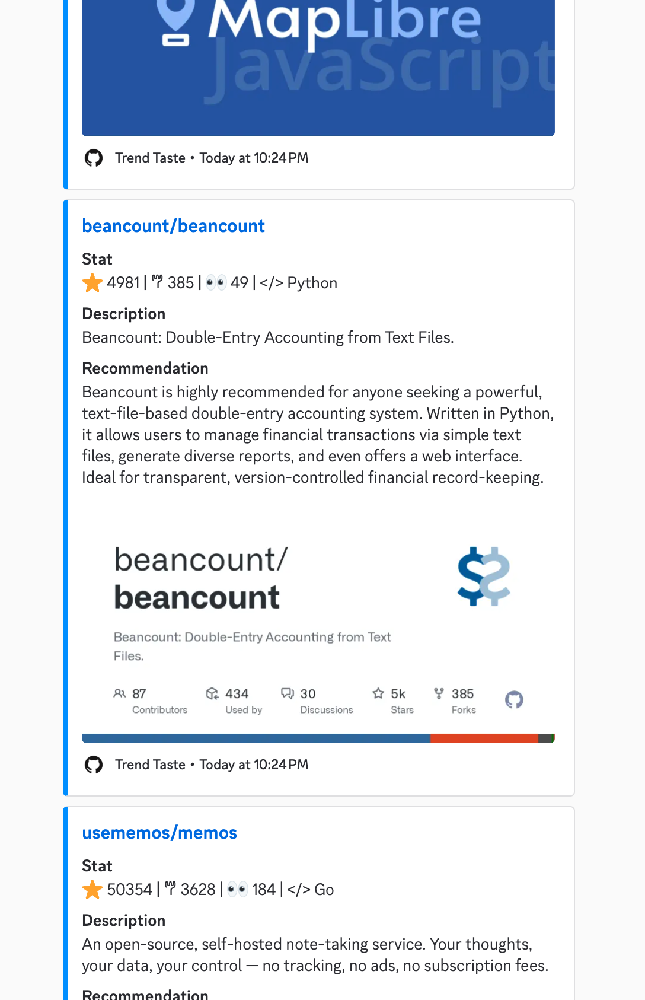

<div align="center">

  

  <h1>Trend-Taste Bot</h1>
  
  <p>
    <b>Github Trending + AI summary = Your Daily Tech News</b>
  </p>
  <p>
    A smart trend push bot based on Discord.js and AI.
  </p>

  []("https://github.com/yyxff/trend-taste/blob/main/LICENSE")
  []("https://github.com/yyxff/trend-taste/stargazers")
  []("https://github.com/yyxff/trend-taste/issues")
  []("https://github.com/yyxff/trend-taste/releases")

  <br> 
  
  
  

  <br><br>

  <a href="https://discord.com/oauth2/authorize?client_id=1451654362265944116&permissions=19456&integration_type=0&scope=bot+applications.commands">
    
  </a>
  <!-- <span>&nbsp;&nbsp;</span> <a href="https://github.com/yyxff/trend-taste">
    
  </a> -->

</div>

---

Trend-Taste is a Discord bot that delivers daily **GitHub Trending repositories** directly to your server. It leverages **AI** to provide personalized, explainable recommendations, helping you stay ahead of the curve in the tech world.

## Features

- **Daily Trending Repos**: Automatically fetches and pushes the hottest repositories from GitHub.
- **AI-Powered Insights**: Uses AI to analyze and summarize why a repository is trending and how it might be useful to you.
- **Multi-Language Support**: Configurable response language (e.g., `en-US`, `zh-CN`).
- **Customizable Schedule**: Set your preferred schedule to fit your timezone and preferred delivery time.
- **Interactive**: Simple slash commands to manage subscriptions and settings.

## Demo

<div align="center">
  
  <p>
    <em>demo</em>
  </p>
</div>

The bot sends a rich embed scheduled at the time you set, containing:
- Repository Name & Description
- Star/Fork counts
- **AI Recommendation**: A concise explanation of the project's value.

## Quick Start

### 1. Invite the Bot
[](https://discord.com/oauth2/authorize?client_id=1451654362265944116&permissions=19456&integration_type=0&scope=bot+applications.commands)

### 2. Configuration & Usage
Once the bot is in your server, you can use the following Slash Commands to set it up:

#### Step 1: Necessary Setup
- **`/set-language [lang]`**  
  Set the language for AI responses (e.g., `en-US`, `zh-CN`).
- **`/set-type [type]`**  
  Set the content type to subscribe to (currently supports `GitHub Trending`).
- **`/set-schedule [timezone] [hour] [minute]`**  
  Set when you want to receive updates (e.g., `Asia/Shanghai 9 0` for 9:00 AM CST).

#### Step 2: Enable Service
- **`/enable`**  
  Activate the daily push service for the current channel.
- **`/disable`**
  Stop the automatic service.
- **`/run`**
  Trigger an immediate fetch and push (useful for testing).

#### Other Commands
- **`/info`**: View current configuration and status.
- **`/help`**: Show the help menu.

---

## Self-Hosting Guide

If you want to host your own instance of Trend-Taste:

### Prerequisites
- `Docker` and `Docker Compose`
- [](https://discord.com/developers/docs/quick-start/getting-started)
- A **Discord Bot Token** (from above)
- A **Discord Application ID** (from above)
- A **Discord Public Key** (from above)
- A **GitHub Personal Access Token** (for higher API rate limits)
- A **Google Gemini API Key** (for AI features)
- A **Github API TOKEN** (for fetching trending repositories)

### Installation

1. **Clone the repository**
   ```bash
   git clone https://github.com/yyxff/trend-taste.git
   cd trend-taste
   ```

2. **Configure Environment**
   Create a `.env` file in the root directory (or update `docker-compose.yml` environment variables). You can copy the example below:

   ```env
   # Discord
   DISCORD_APPLICATION_ID=your_app_id
   DISCORD_PUBLIC_KEY=your_public_key
   DISCORD_TOKEN=your_bot_token

   # GITHUB API TOKEN
   GITHUB_API_TOKEN=your_github_token

   # GEMINI API KEY
   GEMINI_API_KEY=your_gemini_key

   # Database (Optional overrides, defaults provided in docker-compose)
   # POSTGRES_USER=postgres
   # POSTGRES_PASSWORD=password
   # POSTGRES_DB=trendtaste
   ```

3. **Run with Docker Compose**
   ```bash
   docker-compose up -d --build
   ```
   This will start the following services:
   - **app**: The bot logic.
   - **db**: PostgreSQL database.
   - **loki & grafana**: Logging and monitoring stack (accessible at `http://localhost:3000`, default user/pass: `admin`/`admin`).

---

## Developer Guide

For developers who want to contribute or customize the bot.

### Local Development Setup

1. **Install Dependencies**
   ```bash
   npm install
   ```

2. **Database Migration**

   Initialize the database schema:
   ```bash
   npx prisma migrate dev
   ```

3. **Configure Environment**

   Create a `.env` file in the root directory (or update `docker-compose.yml` environment variables). You can copy the example below:

   ```env
   # Discord
   DISCORD_APPLICATION_ID=your_app_id
   DISCORD_PUBLIC_KEY=your_public_key
   DISCORD_TOKEN=your_bot_token

   # GITHUB API TOKEN
   GITHUB_API_TOKEN=your_github_token

   # GEMINI API KEY
   GEMINI_API_KEY=your_gemini_key

   # Database (Optional overrides, defaults provided in docker-compose)
   # POSTGRES_USER=postgres
   # POSTGRES_PASSWORD=password
   # POSTGRES_DB=trendtaste
   ```

3. **Run in Dev Mode**

   Prepare a `docker-compose.override.yml` file under root directory:
   ```yaml
   services:
    app:
        build:
        target: development

        volumes:
        - .:/app
        - /app/node_modules

        # Use `tsx watch` to auto-restart on file changes.
        command: npx tsx watch src/bot.ts

        environment:
        NODE_ENV: development

    # Uncomment the following lines if you want to connect to db from your machine
    # db:
    #   ports:
    #     - "5432:5432"

   ```

### Project Structure
- `src/bot.ts`: Entry point.
- `src/commands/`: Slash command definitions.
- `src/scheduler/`: Scheduler logic.
- `src/tasks/`: Background tasks logic.
- `src/services/`: Service logic.
- `src/repositories/`: Database access logic.
- `src/parser/`: Logic for parsing GitHub data.
- `src/utils/`: Helper functions (GitHub API, Logger).
- `prisma/`: Database schema.


## License
MIT
